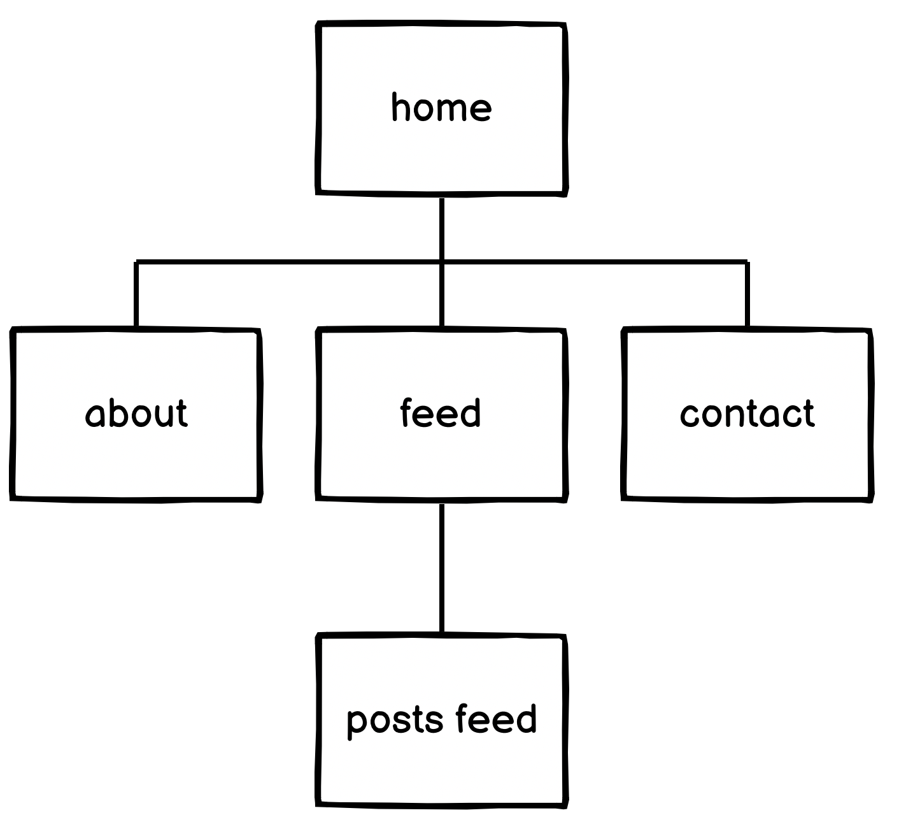
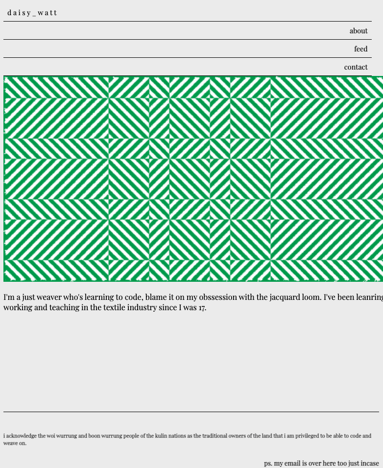
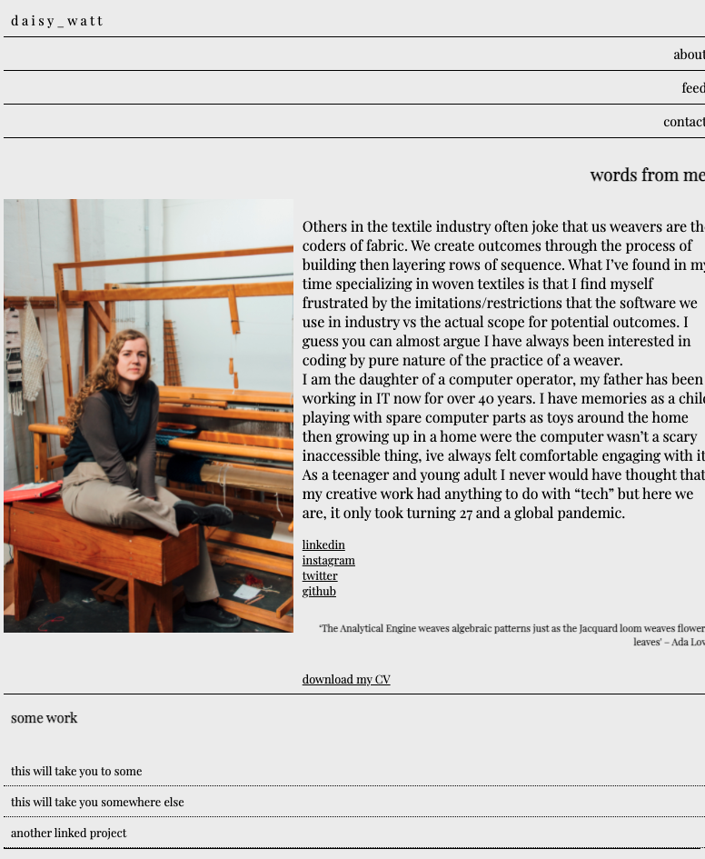
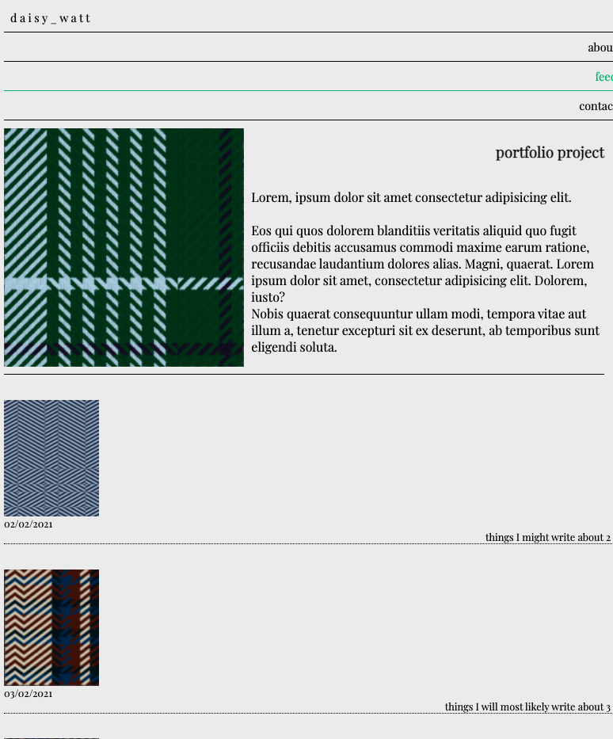
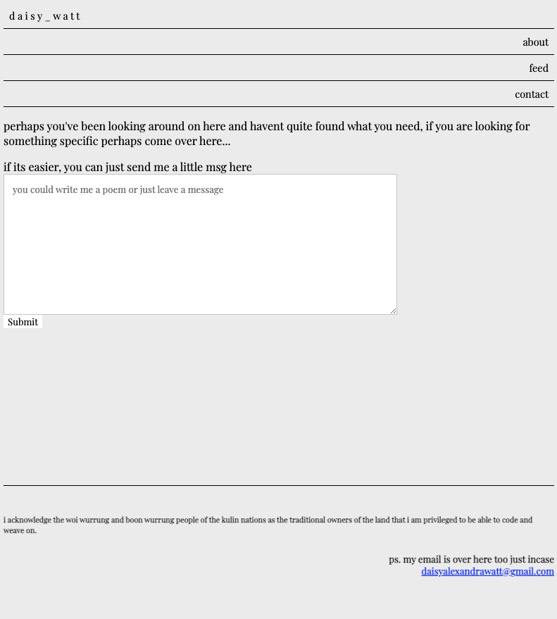

# T1A2-Portfolio-DaisyWatt

coder portfolio T1A2
<!-- link (URL) to my published portfolio website -->
[(https://quirky-hodgkin-7ef6c9.netlify.app/index.html)]

Site Desicription - (Daisy Watt Portfolio T1A2)

Purpose:
this site was deisgned to act as a platform for housing current and future projects specific to my coding learning, in the format of a "portfolio".

Functionality / features:
Simple functionality with use of a clean colour responsive nav bar (made with links, clean lines and breathing room to resemble styling similarities with my CV.

Sitemap:

Screenshots: 

Target audience:
The site is targeted at creative employers looking to engage a multi-disciplinary creative developer. Casual professionalism, playful approach used in the language on the site to refelct my personality.

Tech stack:
VS Code, html, css, netlify (deployment platform)

Limitations and Considerations post production:
Due to time limitations and my average yet emerging skills, I needed to cut back alot of the ideas I had in the development phase. Further resolving to the feed page (previously had designed something that required a level of javascript i am unfamilar with... yet)
